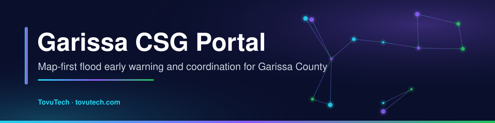
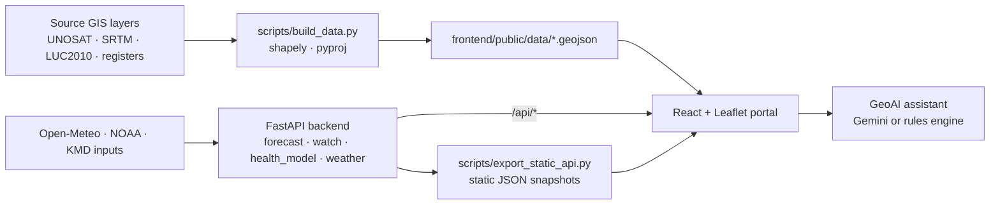

<p align="center">
  <a href="https://jmsmuigai.github.io/Garissa-County-Steering-Group-Portal/"></a>
  
  
  
  <a href="https://www.tovutech.com/projects/csg-portal/"></a>
  <a href="https://jmsmuigai.github.io/Garissa-County-Steering-Group-Portal/"></a>
</p>

## What it is

A trilingual (English · Kiswahili · Af-Soomaali), map-first web portal built for the **Garissa County Steering Group (CSG)**. It brings together El Niño 2026 flood early-warning scenarios, River Tana / Seven Forks forecasting, an "Am I at risk?" location check, health and WASH risk, nature-based solutions, community map-making and the County Partnerships & Coordination Policy in one place.

It is aimed at county officers, CSG partners and residents who need a plain-language picture of flood risk. Forecasts are **decision-support scenarios**, not official warnings — always follow KMD, WRA, NDMA and County Government advisories.

*Web portal developed for the County Government of Garissa, Directorate of ICT & GIS.*

## Highlights

| Page | What it does |
|---|---|
| 🗺️ **Risk map** (home) | Full-screen Leaflet map with movable, foldable windows (layers, legend, tools, base maps, results, gauge); 12 basemaps; 30+ toggleable layers (county and sub-county boundaries, River Tana and 0.5–5 km buffers, UNOSAT 2023–24 flood extents, a 3.0–7.5 m flood simulator, laghas by flash-flood hazard, schools, health facilities, boreholes, water pans, Dadaab camps, KMD stations, Seven Forks dams and catchment, NBS sites, SRTM elevation, LUC2010 / ESA WorldCover land use, WorldPop density, NASA IMERG rain). |
| 📍 **Am I at risk?** | GPS, place search, coordinates or tap-the-map → HIGH / MEDIUM / LOW verdict from past flood extents, simulated stage, distance to the Tana and laghas and land cover; nearest 5 schools and 5 health facilities; sources cited. |
| 🌧️ **El Niño Watch** | Bulletin from the 3–4 Oct 2026 model runs, 16-day flood calendar, first-rains / first-floods timeline, a Python watch simulation (`backend/app/watch.py`), scenario ladder, live Windy and Open-Meteo multi-model views, NOAA CPC charts, trilingual WhatsApp messages. |
| 📈 **El Niño analysis** | Model comparison (ECMWF, GFS, AI models, KMD), a Monte-Carlo rainfall ensemble with exceedance odds, Tana stage forecast with a Masinga fill slider, sub-county impacts. |
| 🌊 **Tana & Seven Forks** | Dam cascade fill/spill, flood-wave travel times Kiambere → Garissa → Delta, gauge forecast against CSG thresholds (4.0 / 5.0 / 6.2 m). |
| 🏥 **Health & WASH** | Disease-risk calendar (AWD, cholera, typhoid, leptospirosis, RVF, malaria and more) under three rainfall scenarios, with mitigation guidance. |
| 🌱 **Nature-based solutions** | 76 screened sites in six families with a site finder that flies the map. |
| 🧭 **Community maps** | Plain-language queries ("schools within 2 km of the Tana in Fafi"), results table and a print-ready map composer → PNG, CSV, GeoJSON. |
| 📄 **Policy, About, Gallery, Report** | Partnerships & Coordination Policy (Aug 2025) with PDF download; CSG mandate; photo lightbox; GPS-tagged emergency reports. |
| 🤖 **GeoAI assistant** | Optional Gemini function-calling agent that drives the map (layers, zoom, find assets, simulate flood, forecasts). Without a key it falls back to a built-in rules engine. |

## How it works



The browser tries the live Python API first, then the static model snapshots, then calls Open-Meteo directly. When the backend is running it refreshes weather/model output every 3 hours.

## Tech stack

| Layer | Tools |
|---|---|
| Frontend | React 19, Vite 6, TypeScript, Tailwind CSS v4, Leaflet / react-leaflet, Recharts, React Router |
| Backend | FastAPI, Uvicorn, Pydantic, httpx, NumPy |
| GIS processing | Shapely, pyproj, SQLite (GeoPackage-style sources) |
| AI (optional) | Google Gemini via `google-genai` |
| Hosting | GitHub Pages (static build in `docs/`) or any server running the FastAPI app |

```
frontend/  React app → frontend/dist (static)
backend/   FastAPI: /api/forecast, /api/watch, /api/forecast/tana, /api/health-risk, /api/weather,
           /api/chat, /api/translate, /api/bulletin, /api/knowledge, /api/feedback, /api/updates
scripts/   build_data.py (GIS → GeoJSON), export_static_api.py (model snapshots → static JSON)
docs/      published GitHub Pages build
```

## Getting started

| You have | Do this |
|---|---|
| **Mac / Linux** | Run `start_portal.command` (first run creates `.env` from `.env.example`, a `.venv`, installs requirements, builds the site if needed and serves http://localhost:8080). |
| **Windows** | Double-click `start_portal.bat`. |
| **Just a browser** | Serve the static build: `cd docs && python3 -m http.server 8080`. Everything works except the Gemini assistant, AI translation and server-side report storage. |

Requirements: Python 3.10+ and (only to rebuild the site) Node.js 20+.

Manual setup:

```bash
python3 -m venv .venv && source .venv/bin/activate
pip install -r requirements.txt
cp .env.example .env            # optional: add GEMINI_API_KEY
cd frontend && npm install && npm run build && cd ..
python scripts/export_static_api.py
cd backend && python -m uvicorn app.main:app --port 8080
```

### Optional API keys

The portal works without any keys. To enable extras:

| Where the portal runs | Where the key goes |
|---|---|
| County / local server | `.env` → `GEMINI_API_KEY=...` (kept private on the server) |
| GitHub Pages, everyone | `docs/portal-config.json` (and `frontend/public/portal-config.json`) → `geminiApiKey` / `openWeatherApiKey`. **This file is public** — restrict the key to `https://jmsmuigai.github.io/*` in the provider console first. |
| GitHub Pages, one device | Assistant → key icon → paste → *Save & test* (stored only in that browser). |

### Updating

- **Publish to GitHub Pages** – `cd frontend && npm run build`, copy `frontend/dist/*` into `docs/`, push.
- **New GIS data** – put files in `source_data/` (git-ignored), run `python scripts/build_data.py`.
- **Model changes** – edit `backend/app/forecast.py` / `health_model.py`, then `python scripts/export_static_api.py`.
- **Partner logos** – add `frontend/public/logos/<id>.png` (`national-government`, `ndma`, `kenya-red-cross`, `kmd`, `unhcr`, `partners`).

See [`USER_GUIDE.md`](USER_GUIDE.md) for a page-by-page guide.

## Data & privacy

Public and institutional datasets (cited in the portal): UNOSAT flood extents (Nov 2023 VIIRS; Apr–May 2024 Sentinel-2/PlanetScope) · geoBoundaries · HydroSHEDS/HydroRIVERS · NASA SRTM · RCMRD/KFS LUC2010 · ESA WorldCover 2021 · WorldPop 2019 · NASA GPM IMERG (GIBS) · KMD forecasts and station ledger · Open-Meteo (ECMWF IFS & AIFS, GFS, ICON, UKMO) · KenGen Seven Forks figures · WRA gauge 4G01 thresholds · KMHFL · county education, water and health registers · Garissa NBS screening (NBSOS) · Garissa County Partnerships & Coordination Policy 2025.

- Raw source data (`source_data/`) and the local feedback database are git-ignored.
- Emergency reports submitted on a self-hosted server are stored on that server only; personal data is not committed to this repository.
- The Gemini assistant only runs if a key is configured; questions are then sent to Google's API.

## Status & roadmap

**Status:** working portal published on GitHub Pages; forecasts are scenario-based decision support built from public model output and should be read alongside official advisories.

Possible next steps:
- Automated re-publishing of the static snapshots on a schedule.
- Official partner logos and reviewed translations.
- Validation of the flood and health scenarios against observed 2026 events.

## Security

Please report vulnerabilities privately — see [SECURITY.md](SECURITY.md). Never commit API keys; use `.env` or a restricted key.

---

<p align="center">
  <b>Built by James M. Mburu · TovuTech Limited</b><br>
  <a href="https://www.tovutech.com">https://www.tovutech.com</a> · <a href="mailto:intelligence@tovutech.com">intelligence@tovutech.com</a><br>
  📖 Case study: <a href="https://www.tovutech.com/projects/csg-portal/">tovutech.com/projects/csg-portal</a>
</p>
